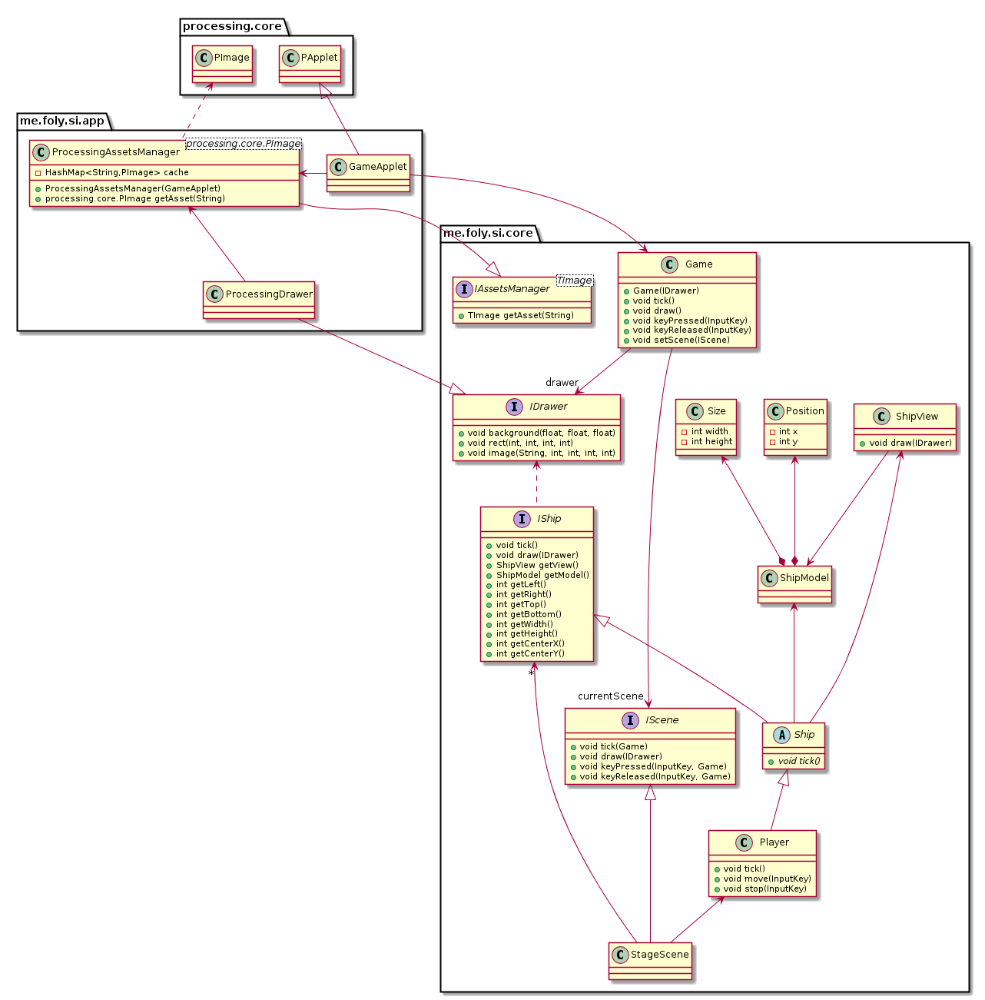
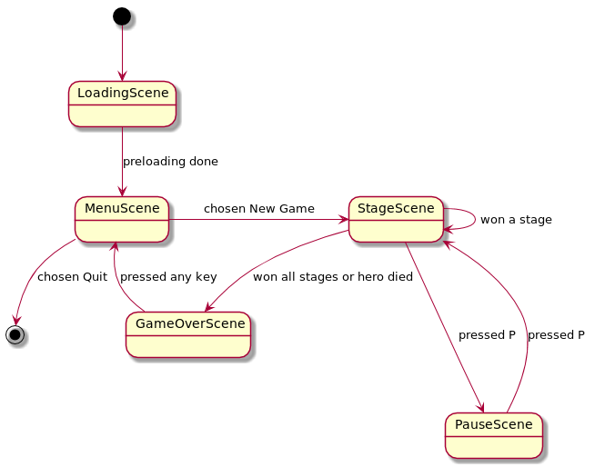

# Pang-java (WIP)
This is a Java port of my space-shooter game [pang-ts](https://github.com/nquocnghia/pang-ts).

We used the library [Processing v3](https://processing.org) as the graphic engine but also tried to make the project _loosely coupled_ with it, which means one can replace Processing by another library with ease.

#### Transitions between scenes (State pattern)

Work In Progress!